<!--
  Every panel on this profile is an SVG drawn by gen/ (Python, no dependencies)
  and redrawn daily by .github/workflows/profile.yml with live numbers from the GitHub API.
  ↑ ↑ ↓ ↓ ← → ← → B A  — on the portfolio that's worth 30 lives.
-->

<p align="center">
  <a href="https://hikaru-0gasawara.github.io/Portifolio/"></a>
</p>

<p align="center"><a href="https://hikaru-0gasawara.github.io/Portifolio/"></a><a href="https://www.linkedin.com/in/hikaru-ogasawara"></a><a href="mailto:hogasawara2311@outlook.com"></a></p>

### `$ whoami` &nbsp;·&nbsp; about

<p align="center">
  
</p>

I started with hardware: connecting a sensor, reading a register, understanding why a signal came in distorted. Then came infrastructure, and then security. I like the boundary where physical becomes logical and where logic can be attacked. Today I'm a **Junior Security Analyst**.

I learn by doing: assemble, test, measure, break and rebuild until it works properly, understanding why before accepting how. I study Computer Engineering at Ibmec and, away from the keyboard, I'm vice president of Ycare, a volunteer organization that delivers food and hygiene baskets to a community on the second Saturday of every month.

```diff
@@ bio.md · d15ca1c · fix(bio): take off shoes @@
- I prefer working with shoes on: layer after layer between me and the machine.
+ I prefer working barefoot: bare metal, nothing between me and the machine.
```

### `$ inventory --equipped` &nbsp;·&nbsp; stack

<p align="center">
  
</p>

### `$ ls ~/projects` &nbsp;·&nbsp; projects

<p align="center"><a href="https://hikaru-0gasawara.github.io/Portifolio/">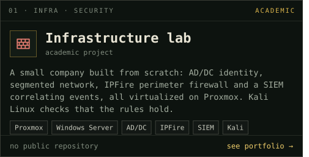</a><a href="https://github.com/Hikaru-0gasawara/IoT-PoolHardWareTest">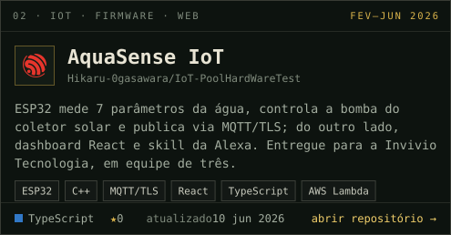</a></p>
<p align="center"><a href="https://github.com/Hikaru-0gasawara/IoT-SafeSistem">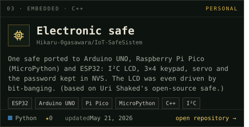</a><a href="https://github.com/0tavio-Pires/Projeto_Back-End">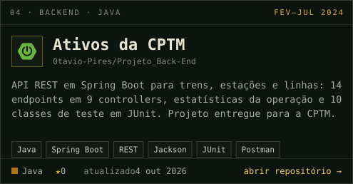</a></p>
<p align="center">
  <a href="https://hikaru-0gasawara.github.io/Portifolio/"></a>
</p>

### `$ gh status` &nbsp;·&nbsp; github

<p align="center">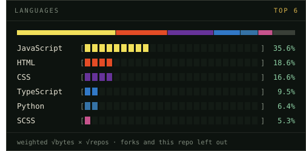</p>
<p align="center">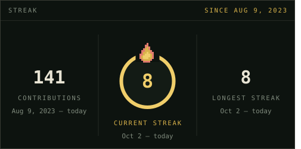</p>
<p align="center">
  
</p>
<p align="center">
  
</p>

### `$ ping hikaru` &nbsp;·&nbsp; contact

Want to talk security, infrastructure or embedded systems? Reach me on [LinkedIn](https://www.linkedin.com/in/hikaru-ogasawara) or at [hogasawara2311@outlook.com](mailto:hogasawara2311@outlook.com). The [portfolio](https://hikaru-0gasawara.github.io/Portifolio/) has my résumé in PT, EN and 日本語, plus a recruiter mode for when you're in a hurry.

<p align="center">
  <a href="https://hikaru-0gasawara.github.io/Portifolio/"></a>
</p>

<details>
<summary><code>$ cat HOW_IT_WORKS.md</code></summary>

<br>

- Nothing here depends on an outside service to load: every panel is an SVG generated by `python -m gen` (standard library only) and served straight from this repository.
- `.github/workflows/profile.yml` runs daily: [Platane/snk](https://github.com/Platane/snk) draws the snake, the generator pulls the numbers from GitHub's GraphQL API, and the bot commits `assets/`.
- Animations are CSS inside the SVGs (GitHub shows images through ``, which runs CSS but never JavaScript). JetBrains Mono and DotGothic16 are embedded, subset to just the characters used.
- The link buttons and the side-by-side cards are separate images placed edge to edge; the gaps are drawn inside each SVG, so every row lines up with the full-width panels.
- The portrait is my photo turned into coloured ASCII by `gen/tools/portrait.py`; the palette, icons and inventory come from the [portfolio](https://github.com/Hikaru-0gasawara/Portifolio).
- To change texts, projects or the inventory: `gen/config.json`. To iterate without spending API calls: `python -m gen --cache data.json`.

</details>
